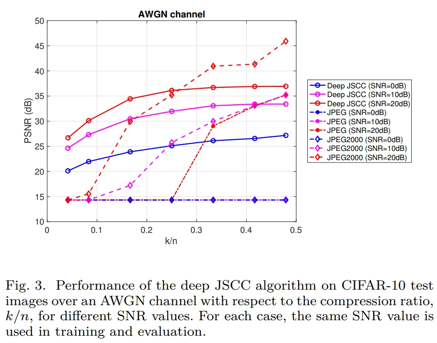

# Still on construction...

## 模型架构应该没问题了，还需要处理一下功率约束的事。
`Chap.III` 提到 `The encoder maps the n-dimensional input image x to a k-length vector of complex-valued channel input samples z`，也就是把一张`[3x32x32]`的图片映射成一个`[kx1]`的复向量并进行功率约束，这里`n=3x32x32=3072`。

`Chap.III` 中给出的功率约束的公式是
$$ z = \sqrt{kP}\frac{\tilde{z}}{\sqrt{\tilde{z}^*\tilde{z}}} $$
其中 $\tilde{z}$ 应该是一个`[kx1]`的向量，分母计算得到的模长是一个常数，保证整个分数的功率为`1`，并根据系数 $\sqrt{kP}$ 进行功率约束。

一张图片编码成 `k` 个符号，信号的平均功率为 `P`，总功率为 `kP`。一次传输 `b` 张图片需要编码成`bK`个符号，信号的平均功率为 `P`，总功率为 `bkP`。因此归一化因子应该是$1/\sqrt{bkP}$。

传输的信号拉直成`[bk, 1]`，信噪比为`snr`，噪声向量的形状也是`[bk, 1]`，总功率为`bkP/snr`，即噪声服从高斯分布$N(0, \sqrt{bkP})$.


##  训练过程应该没有问题，需要重构并封装一下

---
---
---


# Launch Records

## Introduction

Reimplement a `JSCC` solution for weirless image transmission in Pytorch, but **FAILED** to reach the performance mentioned in literature.

[Deep Joint Source-Channel Coding for Wireless Image Transmission](https://arxiv.org/abs/1809.01733).




Reference： [irdanish11 implemantation](https://github.com/irdanish11/DJSCC-for-Wireless-Image-Transmission) and [Ahmedest61 implemantation](https://github.com/Ahmedest61/D-JSCC)

## Technical Solution

Using an `AutoEncoder`to compress image from `[b, 3, H, W]` to feature maps with the shape of`[b, c, h, w]`, feed into channels `[AWGN, Slow Fading Channel]` after power constraint and recover.


## Experimental setup

Use `Adam` optimizer，`batch size` set to `8192`,
`learning rate` set to `1e-3`, and update to `1e-4` after 64 `epoch`. Train 2500 `epoch`.

Train with `SNR` and `compression rate`, where`SNR`varies in `[0, 10, 20]`，`compression rate` varies in `[0.04, 0.09, 0.17, 0.25, 0.33, 0.42, 0.49]`, namely `channel width` varies in `[2, 4, 8, 12, 16, 20, 24]`.

During performance evaluation transmit each image 10 times in order to mitigate the effect of randomness introduced by the communication channel.


## Model Metric

- Loss Function：`MSE Loss`

- Performance Metric：`PSNR`

- Computational Cost：`7s * 2500epochs / 3600 ~= 5h` on a single `4090Ti`

## Experimental result

**Unable to achieve the performance mentioned in literature**.

See [Visualization](visualization.md) for details.


## colab environment setup snippets

This is used to install an old version python on colab for tensorflow 1.15.

```
%env PYTHONPATH = # /env/python
!wget https://repo.anaconda.com/miniconda/Miniconda3-py38_4.12.0-Linux-x86_64.sh
!chmod +x Miniconda3-py38_4.12.0-Linux-x86_64.sh
!./Miniconda3-py38_4.12.0-Linux-x86_64.sh -b -f -p /usr/local
!conda update conda -y
import sys
sys.path.append('/usr/local/lib/python3.8/site-packages')
!conda create -n myenv python=3.6 -y
```
```
%%shell
eval "$(conda shell.bash hook)"
conda activate myenv
pip install tensorflow==1.15 -q
```
