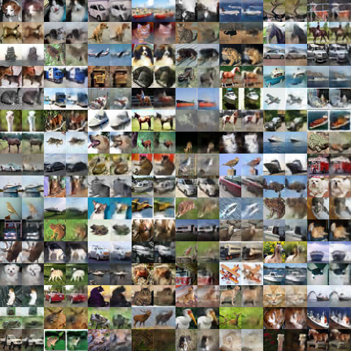
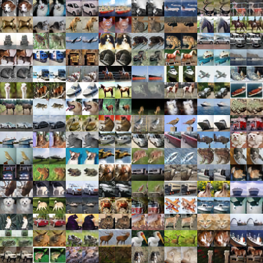

AWGN 00dB 0.04  15.07dB  

AWGN 00dB 0.09  16.99dB  

AWGN 00dB 0.17  19.0dB  

AWGN 00dB 0.25  20.18dB  

AWGN 00dB 0.33  21.08dB  

AWGN 00dB 0.42  21.74dB  

AWGN 00dB 0.49  22.29dB  

AWGN 10dB 0.04  19.36dB  

AWGN 10dB 0.09  22.29dB  

AWGN 10dB 0.17  25.23dB  

AWGN 10dB 0.25  26.99dB  

AWGN 10dB 0.33  27.21dB  

AWGN 10dB 0.42  28.24dB  

AWGN 10dB 0.49  28.54dB  

AWGN 20dB 0.04  21.43dB  

AWGN 20dB 0.09  25.09dB

AWGN 20dB 0.17  29.59dB  

AWGN 20dB 0.25  32.22dB  

AWGN 20dB 0.33  33.01dB  

AWGN 20dB 0.42  33.01dB  

AWGN 20dB 0.49  33.01dB  
